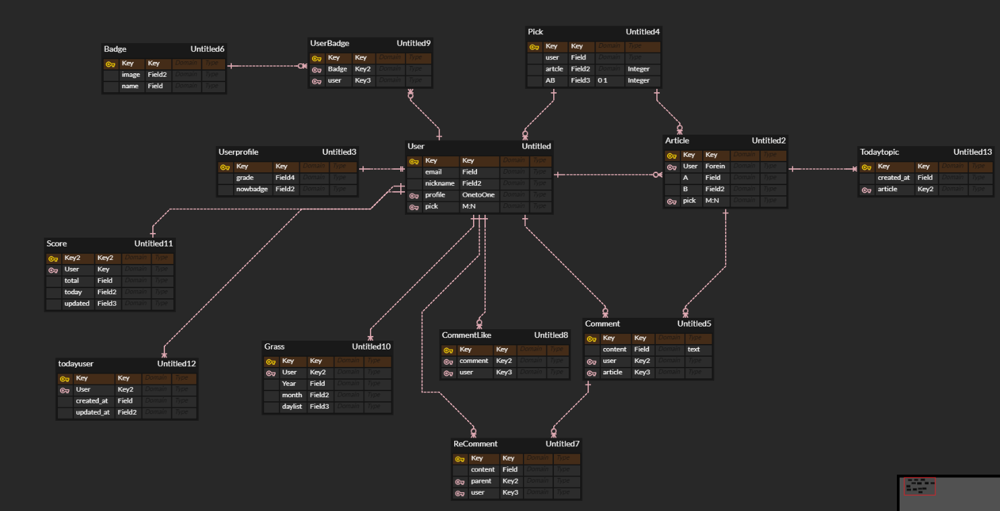
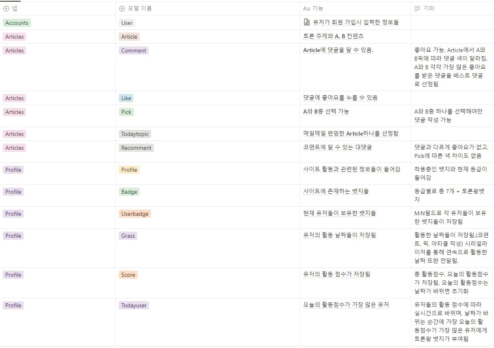

# UNB 백엔드 API

# 목차

0. **개발 목적**

1. **서비스 소개**
2. **기술 스택**
3. **모델 설계 및 기능** 
4. **개발 팀 소개**
5. **개발 기간 및 일정**
6. **프로젝트 후기**

## 0. 개발 목적

그동안 Django만을 사용해 풀스택 개발을 해온 팀원들끼리 모여, 백엔드와 프론트엔드 환경을 완전히 분리해 RESTFUL API 개발 경험을 얻기 위해 시작했습니다.

## 1. 서비스 소개

UNB는 다양한 주제들로 양자택일 토론을 하고, 가볍게 즐길 수 있는 사이트입니다. 또한 뱃지와 등급제도를 통해 한 번 사용하고 마는 사이트가 아닌, 사용자들이 지속적으로 즐길 수 있는 서비스입니다.

## 2. 기술 스택

| Backend            | Database   | Release           | Cooperation |
| ------------------ | ---------- | ----------------- | ----------- |
| Python             | PostgreSQL | Elastic beanstalk | GIT, GITHUB |
| Django Restful API | RDS        | Freenom(domain)   | Discord     |

## 3. 모델 설계 및 기능





## 4. 팀원 소개 및 역할

<a href="https://github.com/psun0610/UNB_Back/graphs/contributors">
  
</a>

|    이름    |                      역할                       |
| :--------: | :---------------------------------------------: |
| **박선영** |       프론트엔드 전반 개발, 디자인, 조장        |
| **하승찬** |          백엔드 전반 개발, 인프라 구축          |
| **이진욱** | 프론트엔드 전반 개발 및 로그인, 소셜로그인 개발 |
| **이준엽** |                   풀스택 개발                   |
| **김광표** |          백엔드 전반 개발, 인프라 구축          |

## 5. 백엔드 API 개발 기간 및 일정

1. **개발 기간 : 11/23 ~ 12/14**
2. **개발 일정**

* 1주차 : DRF 기초 학습
* 2주차 : 백엔드 API 개발 완료
* 3주차 : 배포 후 프론트엔드와 연결 및 디테일한 요구사항, 오류 수정

## 6. 프로젝트 후기

* 박선영

```jsx
```

* 하승찬

```jsx

```

* 이진욱

```jsx
백엔드를 하려고했으나 프로젝트 초반에 프론트와 백엔드를 연결하는 것을 중점적으로 공부하다보니 프론트에 대한 이해도가 높아져 프론트 엔드 개발을 하게 되었습니다. 
첫주에는 너무 막막했고 공부하면서도 이걸 진짜 할 수 있을까 생각했었습니다. 
특히 vue는 react보다 올라오는 자료가 적고 시간이 얼마 지나지 않았음에도 최신 버전과 맞지 않는 자료도 많았습니다. 
그래도 본인의 지식을 공유해주신 여러 개발자분들 덕분에 vue에 대해 공부할 수 있었고 3주만에 vue로 간단한 웹페이지를 만들 수 있었습니다.
열정형을 선택한 것은 정말 좋은 선택이였습니다. 과정이 끝나가면서 느슨해졌는데 열정적인 팀원들에게 자극을 받을 수 있었고 불투명한 진로를 선택하는데 많은 도움이 된 것 같습니다.
또한, 프론트와 백을 분리해서 개발한 덕분에 프론트엔드 백엔드 각각의 이해도도 높아지고 협업하는 느낌을 강하게 받았습니다.
교육 과정 가장 마지막에 이러한 경험을 한다는 것이 너무 아쉬운 것 같습니다.
```

* 이준엽

```jsx

```

* 김광표

```jsx
DRF에 대한 지식이 전혀 없는 상태로, RESTFUL API 개발을 해보고싶다는 생각 하나로 시작한 프로젝트였다. 
정말 제로베이스에서 시작했기에 처음에는 3주만에 완성 할 수 있을까 싶었지만 하다보니 
DRF도 결국 Django에서 비롯했고, Django와 크게 다르지 않다는 것을 깨달았다. 
새로운 것을 배워서 재미있었고, 프론트와 백엔드를 완전히 분리해서 개발을 하다보니 
더욱 더 협업이 중요했기에 협업에 대해 많이 배울 수 있는 시간이었다. 
```

